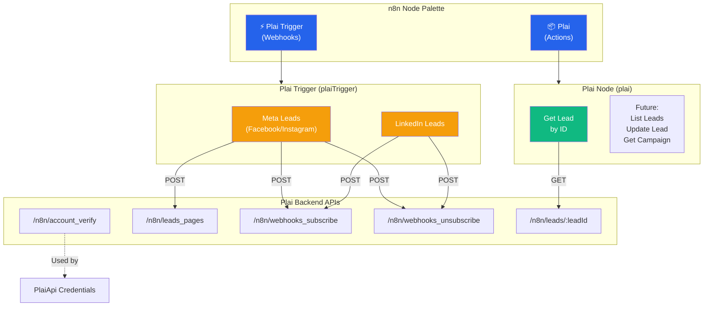
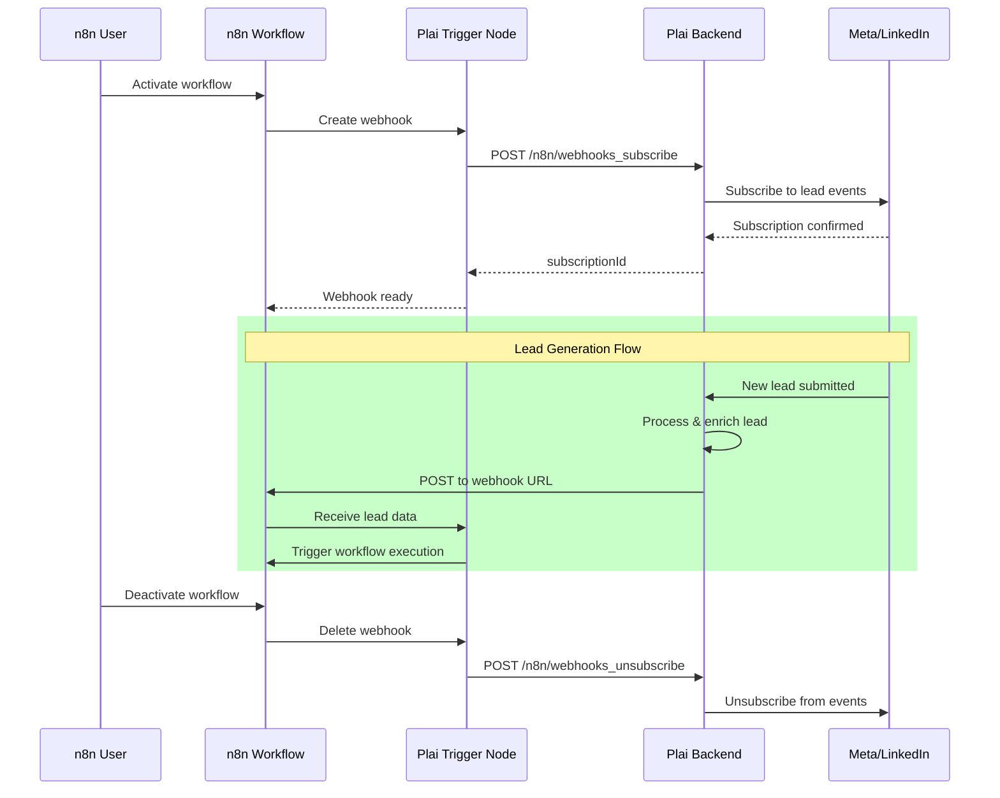
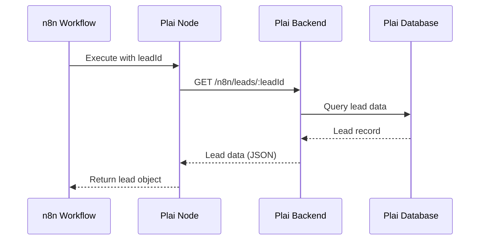
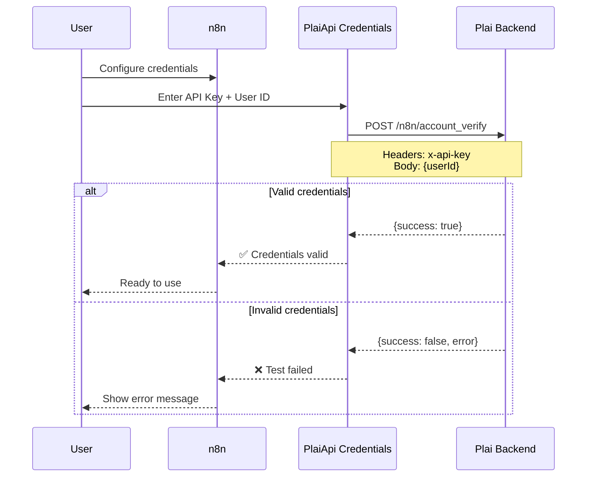

# Plai n8n Nodes - Architecture Overview

## Node Structure



## Data Flow

### 1. Plai Trigger (Real-time Webhooks)



### 2. Plai Action Node (Get Lead)



## File Structure

```
n8n-nodes-plai/
│
├── credentials/
│   ├── PlaiApi.credentials.ts      # x-api-key authentication
│   └── plai.svg                    # Logo
│
├── nodes/Plai/
│   ├── Plai.node.ts                # Main action node
│   │   └── Resource: Lead
│   │       └── Operation: Get Lead
│   │
│   ├── PlaiTrigger.node.ts         # Webhook trigger node
│   │   ├── Platform: Meta
│   │   │   └── Dynamic page selection
│   │   └── Platform: LinkedIn
│   │
│   ├── Plai.node.json              # Codex metadata
│   ├── PlaiTrigger.node.json       # Codex metadata
│   └── plai.svg                    # Logo
│
├── package.json                    # Registers both nodes
│   └── n8n.nodes:
│       ├── dist/nodes/Plai/Plai.node.js
│       └── dist/nodes/Plai/PlaiTrigger.node.js
│
└── README.md                       # Documentation
```

## Lead Data Structure

```json
{
  "leadId": "string",
  "source": "meta_lead_ads | linkedin_lead_ads",
  "name": "string",
  "email": "string",
  "phone": "string",
  "customFields": {
    "company": "string",
    "job_title": "string",
    "...": "..."
  },
  "pageId": "string (Meta only)",
  "adAccountId": "string (LinkedIn only)",
  "campaignId": "string",
  "adsetId": "string",
  "adId": "string",
  "formId": "string",
  "createdTime": "ISO 8601",
  "receivedAt": "ISO 8601",
  "agencyId": "string",
  "workspaceId": "string",
  "userId": "string",
  "clientId": "string"
}
```

## Example Workflows

### Workflow 1: Real-time Lead to CRM

```
[Plai Trigger: Meta Leads]
    ↓
[IF: Email exists?]
    ↓ Yes
[HubSpot: Create/Update Contact]
    ↓
[Slack: Notify #sales]
```

### Workflow 2: Daily Lead Report

```
[Schedule: Daily 9 AM]
    ↓
[Set: Lead IDs array]
    ↓
[Loop through IDs]
    ↓
[Plai: Get Lead]
    ↓
[Aggregate leads]
    ↓
[Gmail: Send report]
```

### Workflow 3: Lead Enrichment

```
[Plai Trigger: LinkedIn Leads]
    ↓
[Plai: Get Lead] (get full details)
    ↓
[Clearbit: Enrich contact]
    ↓
[Salesforce: Create lead]
```

## Authentication Flow



## Error Handling

Both nodes implement comprehensive error handling:

1. **User-Friendly Messages**
   - "No Meta account connected" → Shows steps to connect in Plai
   - "Please select a page" → Clear validation message
   - API errors parsed and displayed with context

2. **Graceful Degradation**
   - Empty page dropdown shows helpful placeholder
   - Failed webhook deletion doesn't break deactivation
   - `continueOnFail` support in Plai node

3. **Developer Context**
   - All errors include `itemIndex` for debugging
   - Nested error responses are automatically parsed
   - Failed operations show in execution logs with full stack

## Future Enhancements

### Plai Node (Actions)
- [ ] List Leads (with pagination and filters)
- [ ] Update Lead (add notes, tags, status)
- [ ] Get Campaign (campaign details)
- [ ] List Campaigns (with filters)
- [ ] Get Ad Performance (metrics)
- [ ] Create Campaign (if API supports)

### Plai Trigger Node
- ✅ Meta leads webhook (complete)
- ✅ LinkedIn leads webhook (complete)
- [ ] Campaign status changes (if requested)
- [ ] Budget alerts (if requested)

---

**Built with ❤️ using n8n node development best practices**
